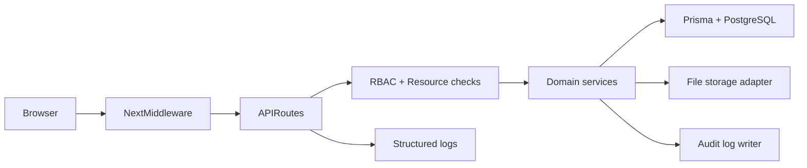

# Architecture

## Overview

GHMS is a modular monolith: a Next.js application exposing a REST API and server-rendered/client UI, backed by PostgreSQL. Modules live under `src/server/modules/*` with thin route handlers in `src/app/api/v1/*`.

## Modules

| Module | Responsibility |
|--------|----------------|
| auth | Login, sessions, password reset, lockout |
| users | Admin user provisioning, session revocation |
| rooms | Room catalog |
| bookings | Reservations, conflicts, whole-house logic |
| cleaning | Tasks, photo-required completion |
| inventory | Stock levels, transactional changes |
| files | Untrusted upload pipeline |
| audit | Append-only security/ops events |
| reports | Aggregates (financial-gated) |

## Request authentication

1. Session token in HttpOnly cookie `ghms_session`
2. Token stored as SHA-256 hash in `sessions` table
3. CSRF double-submit cookie `ghms_csrf` + header `x-csrf-token` on mutations

## Logging

- Application: `pino` (`src/server/lib/logger.ts`) with redaction
- Audit: `audit_logs` table (not user-editable via UI)
- Security channel for auth failures (extensible to SIEM)

## Future expansion

Payment gateways, WhatsApp/email notifications, multi-property, and GST can attach via new modules and tables without breaking existing APIs.
