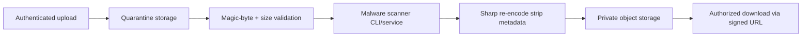

# Malware Scan Upload Pipeline

## Target flow (production)



## Current implementation

| Stage | Status |
|-------|--------|
| Quarantine write | **IMPLEMENTED** (`storage/quarantine`) |
| Validation | **IMPLEMENTED** (size, magic bytes, allowlist) |
| Malware scan hook | **IMPLEMENTED** optional `MALWARE_SCAN_COMMAND` |
| Scan required in prod | **CONFIG** `MALWARE_SCAN_REQUIRED=true` fails closed if command unset |
| Re-encode | **IMPLEMENTED** (Sharp) |
| Private storage | **PARTIAL** (local dev; S3 driver for production) |
| Signed access | **IMPLEMENTED** for S3 GET redirect |

## Operations

Set in production:

```bash
MALWARE_SCAN_COMMAND=/usr/bin/clamdscan
MALWARE_SCAN_REQUIRED=true
STORAGE_DRIVER=s3
```

Scanner should return exit code 0 for clean files, non-zero for infected.

## Residual risk

Without an active scanner integration, polyglot files and zero-day malware may pass validation-only checks.
